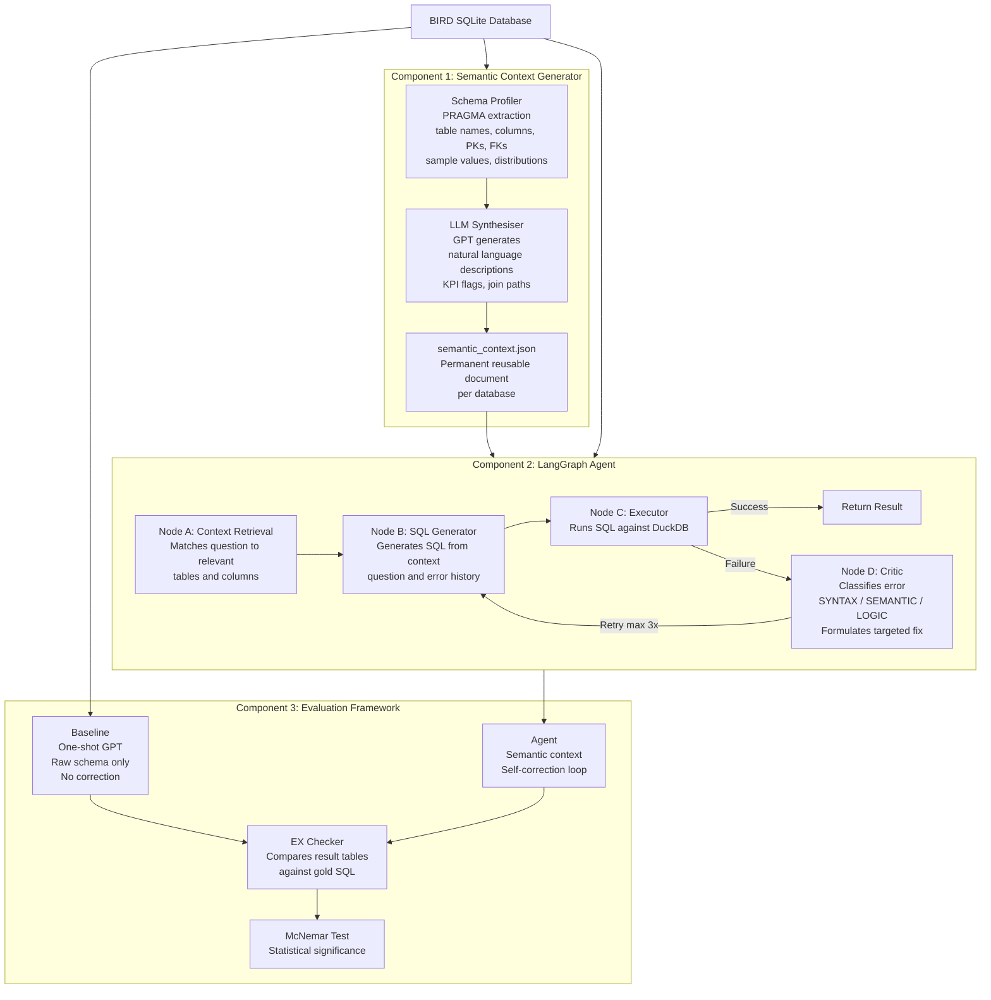

# Agentic AI Architecture for Industrial Text-to-SQL

**MSc Mechatronics Thesis** | Ravensburg-Weingarten University of Applied Sciences  
**Author:** Bhavya Upadhyay  
**Supervisor:** Prof. Dr.-Ing. Wolfram Höpken  
**Co-Supervisor:** Prof. Dr. rer. nat. Marius Hofmeister

---

## Research Question

> To what extent does automated semantic context generation combined with a self-correcting agentic execution loop improve SQL generation accuracy compared to one-shot LLM prompting on complex industrial-style database schemas?

---

## System Architecture



---

## Results — Full BIRD Dev Set (1,534 questions, GPT-4o)

| Metric | Value |
|--------|-------|
| Baseline EX (one-shot, raw schema) | 28.23% |
| Agent EX (semantic context + self-correction) | 38.14% |
| Improvement | +9.91 pp |
| Self-correction rate | 68.6% |
| Agent execution failures | 5.0% vs 15.1% baseline |

---

## Key Findings

- **Evidence routing matters in multi-step pipelines** — evidence hints injected only into Node A's summarization step are silently paraphrased and lose precision; passing them verbatim directly to the SQL generation node is required
- **Benchmark annotation conventions vs real SQL correctness** — some accuracy losses reflect BIRD's unstated gold-query conventions (e.g. implicit NULL exclusion) rather than genuine reasoning failures
- **Data integrity issue discovered in BIRD** — 48 of 129 questions (37.2%) in `european_football_2` reference columns that do not exist in the distributed SQLite file; gold SQL itself fails to execute on this database

---

## Technology Stack

| Component | Technology |
|-----------|------------|
| Language | Python 3.12 |
| Agentic framework | LangGraph |
| Database engine | DuckDB + SQLite |
| LLM | GPT-4o via OpenAI API |
| Benchmark | BIRD (Li et al., 2023) |

---

## Project Structure

```
thesis_project/
├── data/bird/                    # BIRD benchmark databases
├── src/
│   ├── profiler/                 # Component 1 — schema profiling
│   ├── synthesiser/              # Component 1 — LLM synthesis
│   ├── agent/                    # Component 2 — LangGraph nodes
│   └── evaluator/                # Component 3 — evaluation harness
├── outputs/
│   ├── semantic_context/         # Generated JSON files per database
│   └── results/                  # Evaluation results and logs
└── config.py                     # API keys, paths, hyperparameters
```

---

## Benchmark

BIRD: A BIg Bench for Large-Scale Database Grounded Text-to-SQLs  
Li et al., NeurIPS 2023 — [https://bird-bench.github.io/](https://bird-bench.github.io/)