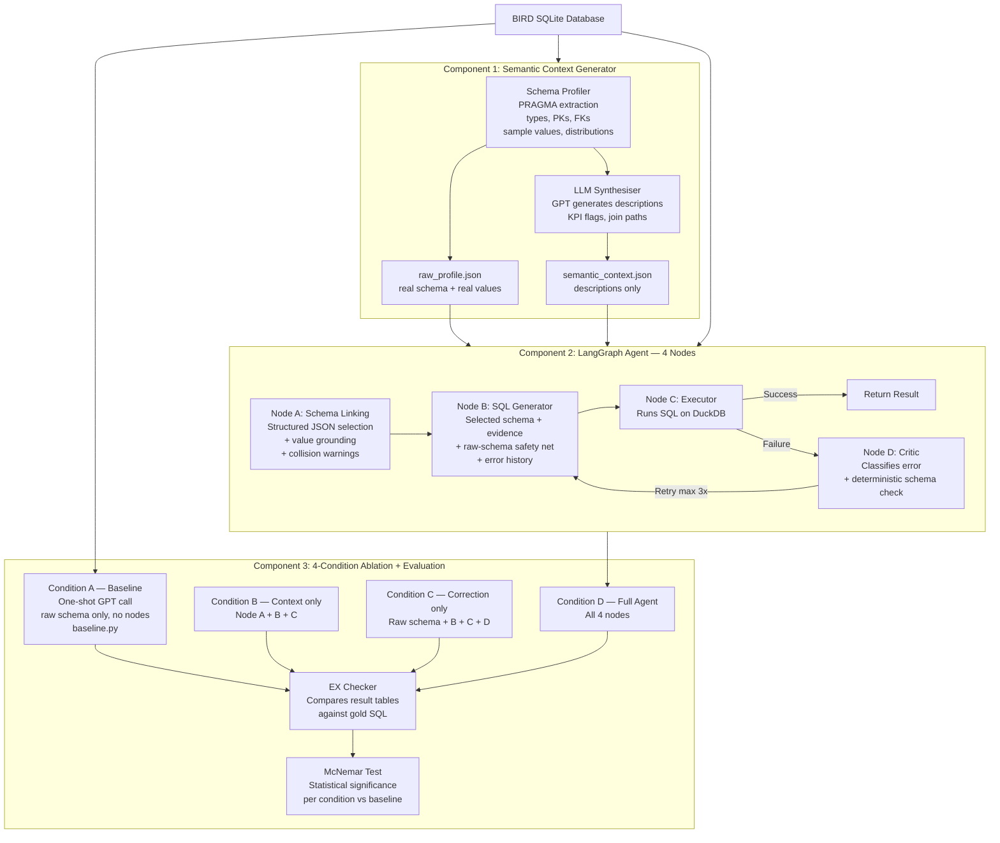

# Agentic AI Architecture for Industrial Text-to-SQL

**MSc Mechatronics Thesis** | Ravensburg-Weingarten University of Applied Sciences  
**Author:** Bhavya Upadhyay  
**Supervisor:** Prof. Dr.-Ing. Wolfram Höpken  
**Co-Supervisor:** Prof. Dr. rer. nat. Marius Hofmeister

---

## Research Question

> To what extent does automated semantic context generation combined with a self-correcting agentic execution loop improve SQL generation accuracy compared to one-shot LLM prompting on complex industrial-style database schemas?

---

## System Architecture



### Ablation design

Isolates the contribution of semantic context (Node A) and self-correction (Node D) independently:

| Condition | Node A (schema linking) | Node D (self-correction) | Purpose |
|---|:---:|:---:|---|
| A — Baseline | — | — | No-help control |
| B — Context only | ✓ | — | Does documentation alone help? |
| C — Correction only | — | ✓ | Does retry-on-failure alone help? |
| D — Full agent | ✓ | ✓ | The complete system |

Baseline still involves an LLM call to generate SQL — it's just a single, standalone one-shot prompt (`src/evaluator/baseline.py`), not the multi-node LangGraph pipeline. Conditions B/C/D reuse the same Node A–D functions in different combinations (`src/agent/graph.py`); Condition C substitutes a raw-schema loader for Node A so its context stays comparable to the baseline.

---

## Results — Full BIRD Dev Set (1,534 questions, GPT-4o, with evidence hints)

| Condition | EX | vs Baseline |
|---|---|---|
| A — Baseline | 49.93% | — |
| B — Context only | 52.09% | +2.15pp |
| C — Correction only | 52.02% | +2.09pp |
| D — Full agent | **54.24%** | **+4.30pp** |

**Statistical significance (McNemar's exact test, each condition vs baseline):**

| Condition | p-value | Significant at α=0.05? |
|---|---|---|
| B — Context only | 0.013 | Yes |
| C — Correction only | 0.0035 | Yes |
| D — Full agent | 8.4 × 10⁻⁷ | Yes, decisively |

All three conditions significantly outperform the one-shot baseline. The full agent (semantic context + self-correction together) shows the largest and most statistically decisive effect.

---

## Key Findings

- **Semantic context and self-correction are complementary, not simply additive.** On controlled ablation, each component alone contributes a modest improvement, but the full agent's gain is larger than either component individually — the correction loop appears to fix cases that only arise once schema linking has already improved the starting point.
- **Self-correction has a hard structural ceiling.** Only ~8–11% of incorrect queries ever throw an execution error the correction loop can react to; of those, only ~21–26% become genuinely correct rather than "fixed" into a different wrong-but-executing query. Confirms recent literature (ErrorLLM) that execution-error-based correction alone cannot catch most real SQL mistakes.
- **Schema linking must be constrained, not free text.** Letting the schema-linking step describe relevant tables/columns in prose gives a model room to describe a plausible-but-wrong join or column as if it were the obvious choice (e.g. picking a real column that exists — with a different meaning — on two different tables). Redesigning it to output a strict, validated selection instead of prose, with deterministic rendering of the actual schema shown to the generator, closes much of this gap.
- **Evidence routing matters in multi-step pipelines** — evidence hints injected only into the schema-linking step are silently paraphrased and lose precision; passing them verbatim directly to the SQL generation node is required.
- **Data integrity issue discovered in BIRD** — 48 of 129 questions (37.2%) in `european_football_2` originally referenced columns that did not exist in the distributed SQLite file; patched by restoring them from a legacy table in the same database.
- **Benchmark grading has real, citable quirks** — BIRD's execution-accuracy metric is sensitive to SELECT column order within a row, and float-precision differences (32-bit vs 64-bit) can cause a *more* numerically accurate answer to fail exact-match grading against a deliberately lower-precision gold query.

---

## Technology Stack

| Component | Technology |
|-----------|------------|
| Language | Python 3.12 |
| Agentic framework | LangGraph |
| Database engine | DuckDB + SQLite |
| LLM | GPT-4o via OpenAI API |
| Benchmark | BIRD (Li et al., 2023) |

---

## Project Structure

```
thesis_project/
├── data/bird/                    # BIRD benchmark databases
├── src/
│   ├── profiler/                 # Component 1 — schema profiling
│   ├── synthesiser/               # Component 1 — LLM synthesis
│   ├── common/                    # Shared, dependency-free utilities (no LLM calls):
│   │                                value grounding, duplicate-column detection, schema helpers
│   ├── agent/                     # Component 2 — LangGraph nodes + 4-condition graph builders
│   └── evaluator/                 # Component 3 — baseline, EX checker, ablation harness
├── outputs/
│   ├── semantic_context/         # Generated JSON files per database
│   └── results/                  # Evaluation results and logs
└── config.py                     # API keys, paths, hyperparameters
```

---

## Benchmark

BIRD: A BIg Bench for Large-Scale Database Grounded Text-to-SQLs  
Li et al., NeurIPS 2023 — [https://bird-bench.github.io/](https://bird-bench.github.io/)